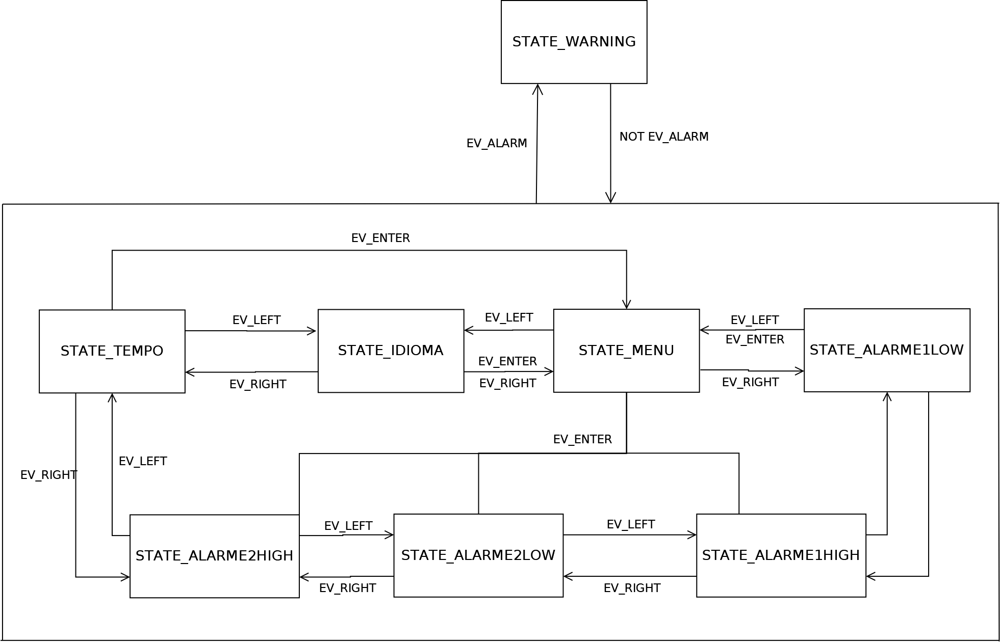
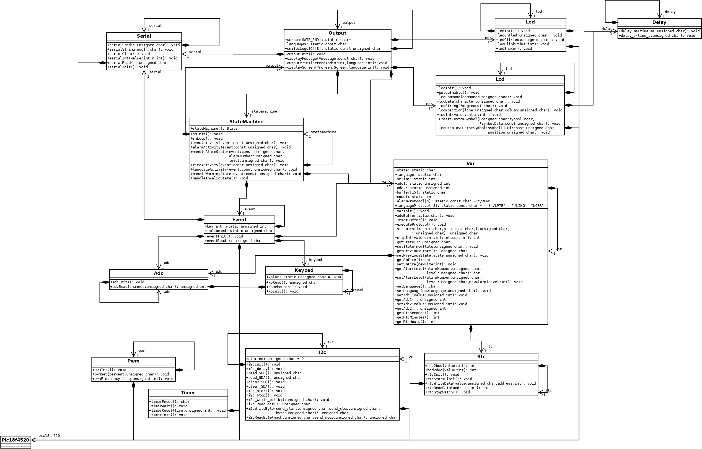

# BoardBring-Up-PIC18F4550

Este repositório contém o código e a documentação para um projeto desenvolvido para a disciplina PBLE02 - BOARD BRING-UP E VALIDAÇÃO DE PROTÓTIPOS ELETRÔNICOS na Universidade Federal de Itajubá (UNIFEI).
O projeto envolveu a montagem e validação de uma placa PCB, incluindo a organização do código, teste de circuitos eletrônicos através de firmware de teste, adaptação/portamento do software da placa de desenvolvimento para o projeto final, e o design e teste de uma Interface Homem-Máquina (IHM) com um menu de opções.

## Objetivos do Projeto

1. Descrever estruturas de organização de código
2. Montar uma placa eletrônica
3. Organizar as informações do desenvolvimento em um documento de projeto
4. Organizar e dividir o trabalho da equipe
5. Testar circuitos eletrônicos através de firmware de teste
6. Adaptar/portar software da placa de desenvolvimento para o projeto final
7. Projetar e testar IHM com menu de opções

## Responsabilidades
Como responsável pelo software da equipe, construí todo o código para o microcontrolador PIC18F4550. Testei os componentes de LCD, ADC, RTC, Comunicação I2C e utilizei o padrão de máquina de estados com eventos para simular uma aplicação de monitoramento com alarme.

## Funcionalidades
A aplicação possui algumas telas (estados), onde o usuário pode:

Configurar o idioma da placa (inglês, português e alemão)
Configurar os limites baixo e alto para 2 entradas analógicas
Receber um alarme quando qualquer valor de leitura estiver fora do intervalo
Visualizar um menu inicial informando o tempo de uso da placa e a logo da UNIFEI
A placa pode ser controlada a partir de comunicação serial USB, ou através da própria placa com botões. O relógio RTC permite contabilizar o tempo de uso e gerar relatórios de alarme, além de servir como memória para o estado atual da placa, para os valores configurados para alarme e idioma também.

## Implementação
A aplicação do software é separada em máquina de estados, eventos e variáveis, separando o que seria as implementações de baixo nível que controlam os componentes. Todo o código foi desenvolvido em C, e foi utilizado o compilador xc8, junto à IDE MPLAB X.

## Projeto

## Demonstração

https://github.com/samuellimabraz/BoardBring-Up-PIC18F4550/assets/115582014/2b1a993e-3f2b-4fdc-afaf-4fec497b80d5

